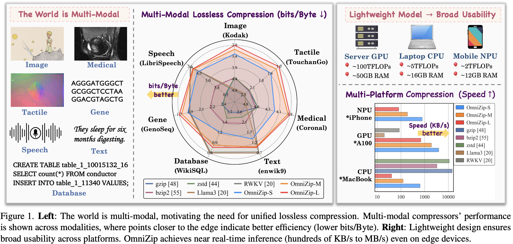

# OmniZip: Learning a Unified and Lightweight Lossless Compressor for Multi-Modal Data

**🎉 Accepted by CVPR 2026 Main Conference**


Lossless compression is essential for efficient data storage and transmission. Although learning-based lossless compressors achieve strong results, most of them are designed for a single modality, leading to redundant compressor deployments in multi-modal settings. Designing a unified multi-modal compressor is critical yet challenging, as different data types vary largely in format, dimension, and statistics. Multi-modal large language models offer a promising resolution but remain too complex for practical use. Thus, we propose \textbf{OmniZip}, \textbf{a unified and lightweight lossless compressor for multi-modal data (like image, text, speech, tactile, database, and gene sequence)}. Built on a lightweight backbone, OmniZip incorporates three key components to enable efficient multi-modal lossless compression: a modality-unified tokenizer that reversibly transforms diverse data into tokens, a modality-routing context learning mechanism that enables flexible multi-modal context modeling, and a modality-routing feedforward design that further enhances the model's nonlinear representation flexibility. A reparameterization training strategy is used to enhance model capacity. OmniZip outperforms or matches other state-of-the-art compressors on multiple modalities, achieving 42\%, 57\%, 62\% and 42\%, 53\% higher compression efficiency than gzip on CLIC-M, TouchandGo, enwik9, LibriSpeech, and WikiSQL datasets, respectively. It also supports near real-time inference on resource-constrained edge devices, reaching about 1MB/s on MacBook CPUs and iPhone NPUs.

<p align="center">
  
</p>

---

## 🚀 Quick Start

### 1) Environment (uv recommended)

**Requirements**
- Python **3.10.16**
- PyTorch **2.1.0 + cu121** (other environments may also work)

```bash
# Create env
uv venv
source .venv/bin/activate

# Install PyTorch (CUDA 12.1)
uv pip install torch==2.1.0 torchvision==0.16.0 torchaudio==2.1.0 \
  --index-url https://download.pytorch.org/whl/cu121

# Install dependencies + project
uv pip install cython numpy pillow sentencepiece nibabel prettytable
uv pip install -e .
```

### 2) Compile Arithmetic Coding (AC) modules (aclibs/)

We provide a Cython-based arithmetic coding implementation in aclibs/.

If Cython compilation fails on your machine, please open an Issue with logs and platform info.

```bash
cd aclibs && bash build.sh && cd ..

# Our AC implementation is based on "https://www.nayuki.io/page/reference-arithmetic-coding", with minor logic modifications and converted to Cython for improved efficiency. 
# If you encounter any issues during use, you can ask us or refer to their source code for comparison.
```

```bash
# Test arithmetic coding
cd aclibs && ./test.sh

# Verify installation
python -c "
from aclibs import arithmetic_coder, bitstreams, frequency_table
print('✓ All modules working')
"
```

## 📦 Datasets 

All dataset processing logic lives in `datasets/`.

Please follow the calling logic in `build.py` to prepare datasets.

## 🔤 Tokenization

OmniZip supports two tokenization modes:
- Pre-tokenization (recommended for text & speech).
- On-the-fly tokenization (tokenize inside the data loader at runtime).

In the current repo, the datasets/ logic is designed to work well with pre-tokenized text/speech, so we recommend pre-tokenizing speech and text for best throughput and simpler data loading.

```bash
# Generate vocabulary / tokenize (for text & speech)
python vocabs/getvocab.py
```

Available tokenized datasets (on SJTU cloud): https://pan.sjtu.edu.cn/web/share/3802e03f83307ca61482db9e403384b3

```bash
# Available tokenized datasets:
# - Text corpora: enwik8, enwik9
# - Speech sequences: LibriSpeech (Byte-encoded wav)
# - Gene sequences: genoseq, dnacorpus
# - Database queries: spider, wikisql
```

## 🧠 Models

All models (including ablations) are in `models/`.

Please follow the calling logic in `build.py` to prepare models.

> Naming note: To clearly distinguish two routing designs in the implementation.
> - MoE refers to routing in feedforward
> - MoA refers to routing in context learning

Primary model (main experiments): `models/rwkv7_hira_vmoa_moe.py`.

There are three model scales:

|--model_size|Params|
|-----------|---------|
|s|	4.8M|
|m|	38M|
|l|	152M|

Each model file contains code in its `__main__` section to compute complexity and parameter counts.

Checkpoints (on SJTU cloud):  https://pan.sjtu.edu.cn/web/share/727d5e69949a0728914d63d114dfd659

## 🏋️ Training

Training entry points: `train.py` and `Trainer.py`.

You can train OmniZip as:
- a single-modality compressor (routing/tokenizer will effectively reduce to single-modality behavior), by selecting modalities by passing one or multiple flags:
`--text | --image | --speech | --medical | --tactile | --gene | --database`.
- a unified multi-modal compressor, by directly setting `--unify`.

**Example A: single-modality (image), model size `s`**
```bash
nohup python train.py \
  --image --moe --moa --amp --accupdate \
  --pretrain_model ./checkpoints/rwkv7_hira_s.pth \
  --name image-moa-moe \
  --model_name rwkv7_hira --model_size s \
  --gpu_ids 6 --batch_size 64 --nepochs 20 --nsteps 20000 \
  > ./logs/image-s.log &
```

**Example B: unified (all modalities), model size `l`**
```bash
nohup python train.py \
  --unify --moe --moa --amp --accupdate \
  --pretrain_model ./checkpoints/rwkv7_hira_vmoa_moe_l.pth \
  --name omni-vmoa-moe \
  --model_name rwkv7_hira_vmoa_moe --model_size l \
  --num_moe_layers 3 --num_moa_layers 3 \
  --num_experts 4 --k 2 --mlp_factor 4 \
  --gpu_ids 6 --batch_size 64 --nepochs 20 --nsteps 20000 \
  > ./logs/omni-vmoa-moe-l.log &
```

**Key training parameters:**
- `--moa`: enable context learning routing (MoA)
- `--moe`: enable feedforward routing (MoE)
- `--amp`: mixed precision training
- `--accupdate`: gradient accumulation
- `--num_moe_layers`: number of blocks using feedforward MoE
- `--num_moa_layers`: number of blocks using context learning MoA
- `--num_experts`: number of experts per routing module
- `--k`: top-k experts
- `--mlp_factor`: 2× the hidden expansion factor inside each feedforward MoE expert
- `--nepochs`: number of epochs
- `--nsteps`: force number of steps per epoch

> Note: the `l` scale model has 3 blocks, so set --num_moe_layers and --num_moa_layers to 3.

**You can use `--debug` for a quick sanity check.**
 

## 🗜️ Compression

Compression entry points: `compress.py` and `Evaler.py`.

The overall logic is consistent with train.py and shares the same modality flags and routing parameters.

**Example A: single-modality compression (image), model size `m`**
```bash
nohup python compress.py \
  --image --moe --moa \
  --pretrain_model ./checkpoints/rwkv7_hira_m.pth \
  --name test-image \
  --model_name rwkv7_hira --model_size m \
  --gpu_ids 6 --batch_size 96 \
  > ./logs/test/image-compression.log &
```

**Example B: unified compression (all modalities), model size `l`**
```bash
nohup python compress.py \
  --unify --moe --moa \
  --pretrain_model ./checkpoints/rwkv7_hira_vmoa_moe_l.pth \
  --name test-omni \
  --model_name rwkv7_hira_vmoa_moe --model_size l \
  --num_moe_layers 3 --num_moa_layers 3 --num_experts 4 \
  --gpu_ids 6 --batch_size 96 \
  > ./logs/test/omni-compression.log &
```

**Arithmetic coding vs cross-entropy bitrate**
- Enable arithmetic coding: `--use_ac`
- Otherwise, the script estimates bitrate via cross-entropy

## 📂 Decompression

Decompression entry point: `decompress.py`

```bash
nohup python decompress.py \
  --use_ac \
  --compressed_file ./experiments/text_compressed.bin \
  --output_file ./decompressed_output.pt \
  --logits_shape 16 1024 16384 \
  --model_name rwkv7_hira_vmoa_moe --model_size m \
  --num_moe_layers 2 --num_experts 4 \
  --gpu_ids 6
```

## 🍎 CoreML Deployment

For deployment on MacBook CPUs and iPhone NPUs, convert the model to CoreML format. See `coreml/` directory for complete conversion scripts.

**Notes**:
- All CUDA operations converted to PyTorch CPU implementations.
- Model quantization available for mobile deployment.


## 🛠 Troubleshooting

**Module Import Error**:
```bash
cd aclibs && bash build.sh
```

**CUDA Out of Memory**:
```bash
# Reduce batch size or model size
--batch_size 32 --model_size xs
```

---

## Reference

@article{zhao2026omnizip,
  title={OmniZip: Learning a Unified and Lightweight Lossless Compressor for Multi-Modal Data},
  author={Zhao, Yan and Cheng, Zhengxue and Zhang, Junxuan and Zhou, Dajiang and Gu, Qunshan and Wang, Qi and Song, Li},
  journal={arXiv preprint arXiv:2602.22286},
  year={2026}
}
